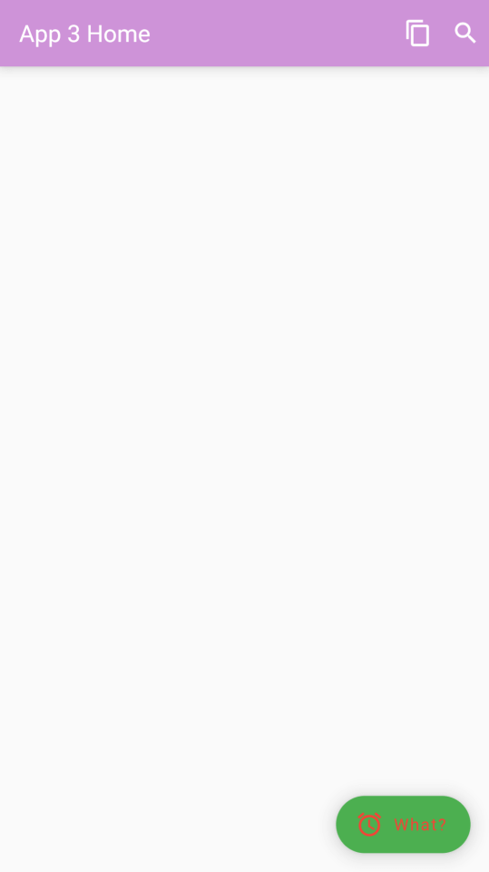
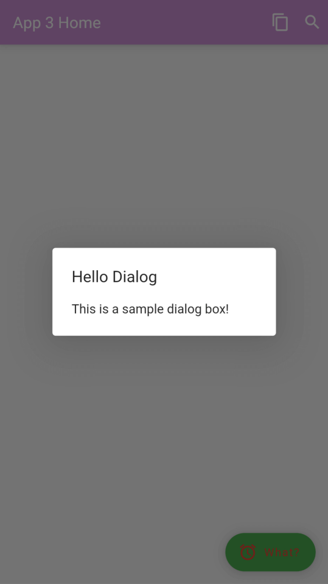

# flutter_app_3

The third Flutter "app".

## Getting Started

This Flutter project was created using the following command line:

```bash
flutter create flutter_app_3 --platforms=android,web --org com.eduhoratiu
```
---

**Go to [main.dart](lib/main.dart) and start editing and improving the code!**

## Screenshots

<p float="left">
  
   
</p>

---

A few resources to get you started:

- [Lab: Write your first Flutter app](https://docs.flutter.dev/get-started/codelab)
- [Cookbook: Useful Flutter samples](https://docs.flutter.dev/cookbook)

For help getting started with Flutter development, view the
[online documentation](https://docs.flutter.dev/), which offers tutorials,
samples, guidance on mobile development, and a full API reference.

